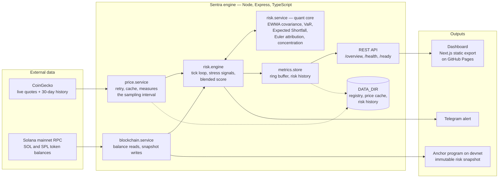
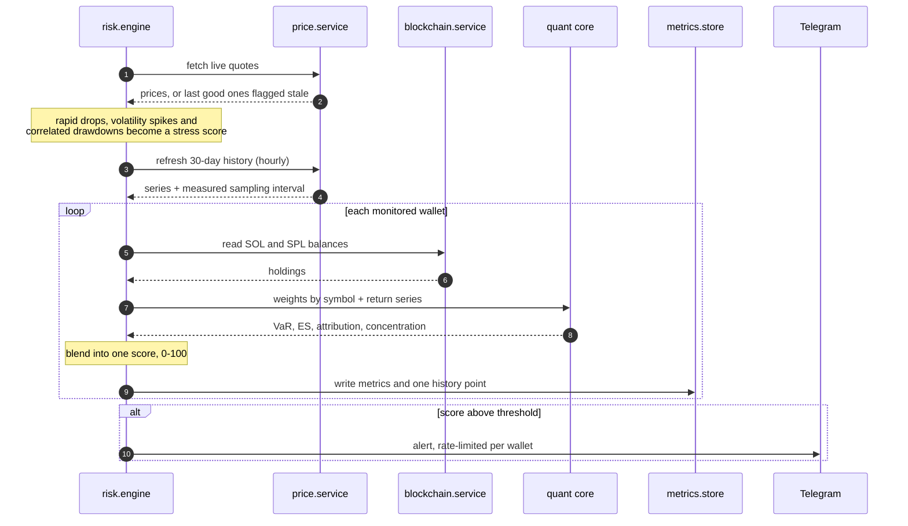
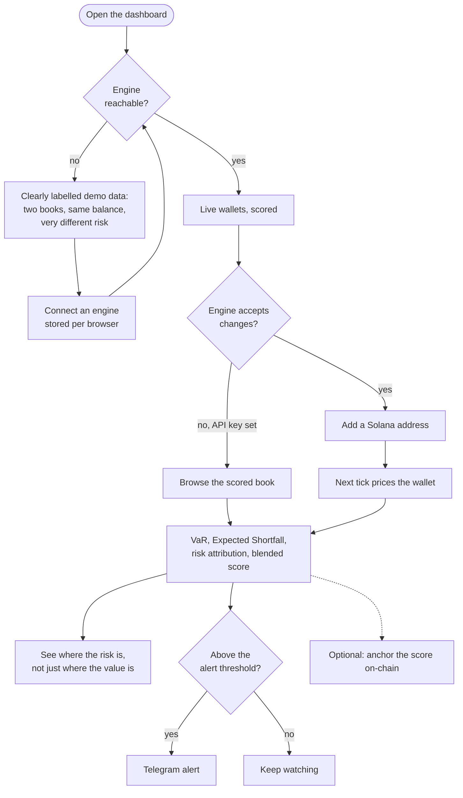

<div align="center">

# Sentra

**A portfolio risk engine for Solana.**

Your wallet balance tells you what you have.
Sentra tells you how much you stand to lose.

[**Open the dashboard →**](https://abhist17.github.io/sentra/)

</div>

---

## The problem

Every Solana wallet UI answers the same question: *what is this worth right now?*

None of them answer the one that matters when the market turns: *how much of this
can disappear tomorrow?*

Two wallets can hold $50,000 each and carry completely different risk. One split
evenly across four assets with low correlation. One sitting 97% in a single
volatile token. Same balance, very different night's sleep.

Sentra measures that difference continuously, using the same model a trading desk
would use — **Value at Risk** — and turns it into one number between 0 and 100.

---

## What it does

Every 30 seconds, for every wallet you monitor:

1. **Prices the book.** Reads real SOL and SPL token balances from Solana
   mainnet, values them against live CoinGecko quotes.
2. **Computes Value at Risk and Expected Shortfall.** Builds an
   exponentially-weighted covariance matrix from 30 days of price history and
   derives both the 95% one-day VaR — the loss exceeded on about one day in
   twenty — and the Expected Shortfall, the average loss *given* that it is
   exceeded.
3. **Scores market stress.** Watches for volatility spikes, rapid drops, and
   assets falling together, and combines them into a systemic stress score.
4. **Blends them into one score.** VaR plus penalties for concentration, a
   falling lead asset, and market stress — capped at 100.
5. **Acts on it.** Sends a Telegram alert above your threshold, and optionally
   writes an immutable snapshot to a Solana program.

```
Solana mainnet ──┐
                 ├──▶  quant engine  ──▶  blended risk score  ──▶  dashboard
CoinGecko feed ──┘           │                    │
                             │                    ├──▶  Telegram alert
                   30-day covariance              │
                   + live stress signals          └──▶  on-chain snapshot
```

---

## Reading the score

The score is not a price prediction. It is an estimate of **downside exposure**
under current conditions.

| Band | Score | Meaning |
|:--|:--|:--|
| **Calm** | 0 – 24 | Loss potential within normal range |
| **Watch** | 25 – 44 | Above baseline — worth checking |
| **Elevated** | 45 – 69 | Meaningful downside concentration |
| **Severe** | 70 – 100 | Large modelled loss at 95% confidence |

### What goes into it

| Component | Range | What it measures |
|:--|:--|:--|
| Value at Risk | 0 – 100 | 95% one-day loss as a share of portfolio value |
| Concentration | 0 – 20 | How much of the book rides on too few positions |
| Market stress | 0 – 25 | Systemic signals scaled into the score |
| Trend | 0 / 5 | Penalty when the heaviest holding is falling |

The dashboard shows this breakdown for every wallet, so the number is never a
black box — you can always see which component moved it.

Concentration is the worse of two continuous measures: how dominant the largest
position is, and how many assets the book *effectively* holds by the
Herfindahl index. Either alone has a blind spot the other covers — the largest
weight cannot tell 50/50 from 50/10/10/10/10/10, and the Herfindahl term alone
would let a 75% position hide behind a long tail of small ones. Both ramps are
continuous on purpose: a threshold that jumps ten points the instant a holding
crosses 50% turns a rounding-error price move into an alert.

### Weight is not risk

A balance readout says *"you hold 11% BONK"*. Sentra says *"BONK is 29% of what
you stand to lose"*.

The two diverge whenever an asset's volatility differs from its size, and the
gap is the only part you can act on. Sentra splits portfolio VaR across assets
by Euler allocation, so the components sum exactly to the total — an
attribution, not a heuristic.

| Asset | Share of value | Share of risk |
|:--|--:|--:|
| SOL | 76.4% | 70.9% |
| BONK | 11.4% | **28.9%** |
| USDC | 12.2% | 0.1% |

It also reports a **diversification ratio**: weighted average standalone
volatility over portfolio volatility. At 1.0 the holdings move as one and
spreading across tickers is buying nothing.

### How the loss estimate is built

Two models run on every tick, and the dashboard shows both:

| Model | How | Strength |
|:--|:--|:--|
| **Parametric** | EWMA covariance, normal tail | Reacts to the current volatility regime |
| **Historical** | Empirical quantile of compounded horizon returns | Carries the realised tail, no distribution assumed |

The headline figure is the **more conservative of the two** — reporting the
smaller of two defensible numbers would be choosing the flattering one.

Three details that matter more than they sound:

- **The horizon is measured, not assumed.** The price feed returns hourly
  observations for a 30-day window, so volatility computed from them is
  *hourly*. Sentra measures the sampling interval from the data's own
  timestamps and scales to a true one-day figure. Skipping this understates a
  one-day VaR by √24 ≈ 4.9×.
- **The EWMA decay is frequency-aware.** λ = 0.94 is RiskMetrics' default for
  *daily* data (~17 days of memory). Applied unchanged to hourly observations
  it means 17 *hours*, and the estimator measures intraday noise instead of
  volatility — on real SOL data that doubled the reported VaR. Sentra rescales
  λ so the memory stays fixed in calendar terms.
- **Sample size is reported.** Overlapping windows inflate the apparent
  observation count without adding information, so the dashboard shows the
  number of *independent* observations and says plainly when the tail rests on
  too few.

> **A note on honesty:** these are model estimates. VaR assumes tomorrow rhymes
> with the recent past, and even Expected Shortfall says nothing about what
> happens beyond the sample. When an asset has no return history behind it,
> Sentra reports the reduced coverage rather than quietly scoring it as
> riskless. Not investment advice.

---

## Try it

**Hosted dashboard:** [abhist17.github.io/sentra](https://abhist17.github.io/sentra/)

It opens with demo data — two example books holding similar value but carrying
very different risk, which is the argument the whole product makes. Everything
is labelled as synthetic; nothing pretends to be live.

For real numbers, point it at an engine. Start one locally and it connects
straight away:

```bash
git clone https://github.com/Abhist17/sentra
cd sentra/sentra/backend
npm install
npm run dev          # engine on http://localhost:4000
```

Then open the hosted dashboard and use **Connect to an engine** → `http://localhost:4000`.

No API keys, no wallet, no Solana toolchain required — the engine runs read-only
out of the box and ships with a demo wallet already monitored.

> Browsers block a page served over HTTPS from calling a loopback address
> unless the server opts in. The engine sends the required
> `Access-Control-Allow-Private-Network` header by default, which is what makes
> this work. If you would rather not have that, set `ALLOW_PRIVATE_NETWORK=false`
> and run the dashboard locally too — see below.

### Or run the whole stack

```bash
docker compose up
# dashboard  http://localhost:3000
# engine     http://localhost:4000
```

---

## Deploy your own

### Engine → Render

The repo includes a [`render.yaml`](render.yaml) blueprint.

1. **Render → New → Blueprint**, point it at your fork
2. Accept the defaults — every secret is optional
3. Copy the resulting URL, e.g. `https://sentra-engine.onrender.com`

The blueprint provisions a persistent disk for the wallet registry and price
cache, generates an `API_KEY` for the write routes, and sets a health check.

> Render's free tier sleeps after inactivity, so the first request after a
> quiet period takes a few seconds and the risk history starts fresh.

**Worth setting:**

| Variable | Why |
|:--|:--|
| `MAINNET_RPC_URL` | The public Solana endpoint rate-limits hard. Use Helius or QuickNode. |
| `CORS_ORIGIN` | Lock to your dashboard's origin instead of `*`. |
| `ALLOW_PRIVATE_NETWORK` | Leave `true` only if you drive this engine from a page on another origin. |
| `TELEGRAM_BOT_TOKEN` / `TELEGRAM_CHAT_ID` | Enables alerts. |
| `COINGECKO_API_KEY` | Raises the price-feed rate limit. |

### Dashboard → GitHub Pages

Already wired up. [`deploy-pages.yml`](.github/workflows/deploy-pages.yml)
builds the static export and publishes it on every push to `main`.

To give your deployment a default engine, set the repository variable
`NEXT_PUBLIC_API_URL` to your Render URL
(**Settings → Secrets and variables → Actions → Variables**). Without it the
dashboard simply asks each visitor which engine to connect to.

### Anywhere else

Both services have a `Dockerfile`. The dashboard is a plain static bundle, so
Vercel, Netlify, Cloudflare Pages and S3 all work — set the root directory to
`sentra/frontend` and leave `NEXT_PUBLIC_BASE_PATH` unset.

---

## The dashboard

Built as a working instrument rather than a landing page.

- **Colour carries meaning, nothing else.** The interface is monochrome; colour
  appears only for risk band and asset allocation. When something is coloured on
  screen, it is telling you something.
- **Keyboard-first.** `j`/`k` or arrows move between wallets, `/` adds one. The
  trend chart takes focus too — left/right step through the series, home/end
  jump to either end.
- **The time axis is real.** Points are placed by timestamp, not by index, and
  a gap wider than the usual cadence breaks the line instead of drawing across
  it. An engine that was off for three hours looks like it was off for three
  hours.
- **Sparklines** in the wallet list: the current score says which book is worst
  now, the shape says which is getting worse.
- **Every figure is traceable.** The score breakdown shows exactly which
  component contributed what.
- **Honest states.** A degraded price feed, a stale tick, an engine error and
  incomplete return coverage each say so explicitly rather than rendering a
  confident-looking number.
- **Announced, not just coloured.** Risk-band and engine-state changes reach a
  live region, so the transitions colour carries are not sighted-only.
- Light and dark, following your system preference.
- Charts are hand-rolled SVG — no charting dependency.

---

## Architecture



Two clusters, deliberately. Balances are **read** from mainnet, because that is
where the money is. Snapshots are **written** to devnet, because anchoring a
score should not cost mainnet rent to demonstrate. The quant core is pure —
no network, no clock, no I/O — which is why it is the part with the most tests.

### What happens in one tick



A tick that overruns skips the next slot rather than overlapping it, and a
wallet removed mid-tick is discarded rather than written back.

### What a user does



### Repository layout

```
sentra/
├── sentra/
│   ├── frontend/            Next.js dashboard (static export)
│   │   ├── app/                 page + design tokens
│   │   ├── components/          dial, trend chart, tables, panels
│   │   └── lib/                 API client, formatting, theming
│   │
│   ├── backend/             Express API + quant engine
│   │   ├── src/engine/          risk.engine.ts — the tick loop
│   │   ├── src/services/        prices, risk math, chain, telegram, registry
│   │   ├── src/store/           in-memory metrics + risk history
│   │   └── src/__tests__/       unit tests for the quant core
│   │
│   ├── programs/sentra/     Anchor program (Rust)
│   ├── tests/               Anchor integration tests
│   └── scripts/gen-idl.js   regenerates the bundled IDL
│
├── render.yaml              engine blueprint
└── docker-compose.yml       full local stack
```

| Layer | Technology |
|:--|:--|
| Dashboard | Next.js 16 · React 19 · Tailwind CSS 4 |
| Engine | Node.js · Express 5 · TypeScript |
| Program | Rust · Anchor 0.32 |
| Price feed | CoinGecko |
| Alerts | Telegram Bot API |

---

## API

The engine is a plain REST service — the dashboard is only one possible client.

| Method | Route | Purpose |
|:--|:--|:--|
| `GET` | `/health` | Liveness, build version, engine state, feature flags |
| `GET` | `/ready` | Readiness — 503 with the failing checks when not scoring |
| `GET` | `/overview` | Everything the dashboard needs, in one call |
| `GET` | `/risk` | Value-weighted risk across all wallets |
| `GET` | `/portfolio` | Total exposure and aggregate VaR |
| `GET` | `/prices` · `/market` | Live quotes, per-tick changes, stress signals |
| `GET` | `/history?wallet=` | Risk series, persisted across restarts |
| `GET` | `/wallets` | Monitored wallets with their latest metrics |
| `POST` | `/wallet/add` | `{ address, label? }` |
| `DELETE` | `/wallet/remove` | `{ address }` or `?address=` |
| `GET` | `/snapshots?wallet=` | On-chain snapshot history |
| `POST` | `/test/alert` · `/test/shock` | Send a test Telegram message |

Write routes require an `x-api-key` header whenever `API_KEY` is set. All routes
are rate-limited per IP.

`/health` and `/ready` answer different questions on purpose. `/health` is
liveness and always returns 200 if the process can respond — point platform
probes at it. `/ready` reports whether the engine has completed a recent tick
and loaded a return series, and returns 503 naming what is failing. Failing a
platform probe on readiness would restart the container every time the public
price feed rate-limits, which a restart cannot fix.

```bash
curl https://your-engine.onrender.com/risk
# {"risk":25.85,"wallets":1,"updatedAt":1787413812004}
```

---

## The on-chain program

Risk scores can be committed to Solana as immutable, timestamped snapshots — so
a claim about historical risk is verifiable rather than trusted.

| Instruction | Purpose |
|:--|:--|
| `initialize_preferences(threshold)` | Creates the caller's risk-preference PDA |
| `update_threshold(new_threshold)` | Changes the alert threshold |
| `record_risk_score(score, timestamp)` | Writes a snapshot, emits `RiskAlertEvent` |
| `close_snapshot()` | Closes a snapshot and refunds its rent |

```bash
cd sentra
anchor build
anchor deploy --provider.cluster devnet
cd backend && npm run init      # creates the risk-preference PDA
```

Then set `ENABLE_ONCHAIN_WRITES=true` and point `RPC_URL` at devnet.

**This is off by default and should stay off unless you want it.** Every
snapshot rents a new account, so writing on a 30-second interval costs SOL
continuously. `close_snapshot` exists to reclaim that rent.

> `anchor build` regenerates `backend/src/idl/sentra.json`. If the Solana
> platform tools cannot be downloaded, `node scripts/gen-idl.js` reproduces a
> byte-identical IDL from the program source.

---

## Development

```bash
cd sentra

npm run install:all      # backend + frontend dependencies
npm run dev:backend      # engine  → :4000
npm run dev:frontend     # dashboard → :3000

npm test                 # backend + frontend
npm run typecheck        # both packages
anchor test              # program integration tests
```

### Tests

144 tests, none of which need the network.

| Suite | Count | Covers |
|:--|--:|:--|
| Quant core | 40 | Horizon scaling, EWMA, VaR/ES, historical simulation, Euler attribution, concentration |
| Market signals | 17 | Drops, volatility window, correlation breakdown, stress bands |
| HTTP API | 26 | Routing, validation, error mapping, API key, rate limiting, CORS, readiness |
| Wallet registry | 7 | Address validation, limits, persistence |
| Store | 8 | History ring buffer, and what a restart is allowed to reinstate |
| Frontend | 35 | Formatting across eight orders of magnitude, risk bands, engine status, engine-URL resolution |
| On-chain | 11 | PDA derivation, authorization, timestamp bounds, rent reclaim |

### Configuration

Everything is environment-driven — see
[`backend/.env.example`](sentra/backend/.env.example) for the full list.

| Variable | Default | Notes |
|:--|:--|:--|
| `MONITOR_INTERVAL` | `30000` | Tick interval in ms; floor of 10s |
| `RISK_ALERT_THRESHOLD` | `25` | Score that triggers a Telegram alert |
| `HISTORY_DAYS` | `30` | Days behind the covariance matrix |
| `VAR_HORIZON_DAYS` | `1` | Reporting horizon for VaR and ES |
| `VAR_CONFIDENCE` | `0.95` | One day in twenty |
| `VAR_LAMBDA` | `0.94` | Daily-equivalent EWMA decay, rescaled to the sampling rate |
| `RELEASE` | package version | Build identifier reported by `/health` |
| `MAX_WALLETS` | `25` | Each wallet costs an RPC call per tick |
| `DATA_DIR` | `./.data` | Wallet registry, price cache and risk history — mount a volume on ephemeral hosts |
| `SIMULATION_MODE` | `false` | Synthetic portfolio for empty wallets — demos only |
| `ENABLE_ONCHAIN_WRITES` | `false` | Costs SOL on every interval |

---

## Built for

**Turbin3 Builder Cohort** — Capstone Project

---

<div align="center">
<sub>Risk figures are model estimates, not investment advice.</sub>
</div>
